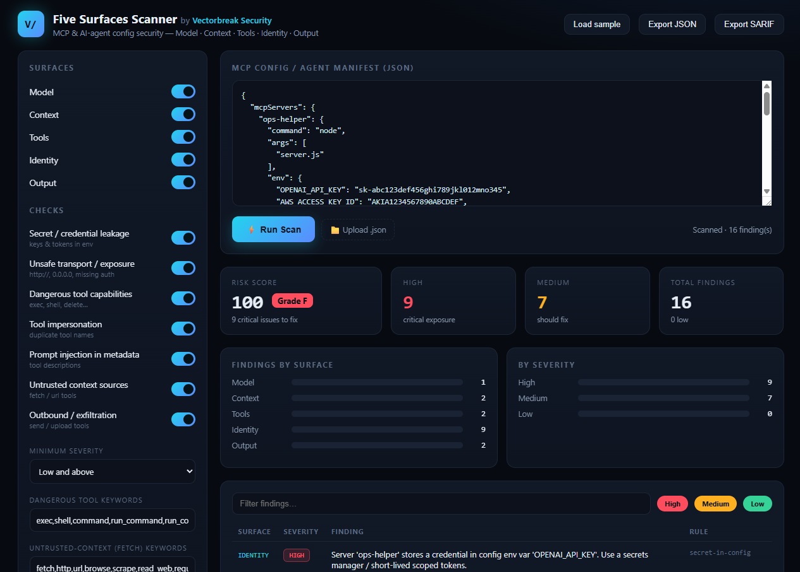

# Five Surfaces Config Scanner

**A free, static configuration scanner for MCP (Model Context Protocol) servers and AI-agent manifests.** It flags risky configuration — tool-description poisoning, dangerous capabilities, tool impersonation, untrusted retrieval sources, outbound exfiltration paths, and exposed secrets/transport — and maps every finding to the **[Five Surfaces methodology](https://vectorbreak.com/methodology)** by Vectorbreak.

> This is a lightweight, static *first pass* — heuristics over your config, run in your browser or in CI. It is **not** a replacement for dynamic testing or a full assessment. For dynamic Surface-3 fuzzing see **[mcp-fuzzer](https://vectorbreak.com/mcp-fuzzer)**; for an assessment across all five surfaces see the **[methodology](https://vectorbreak.com/methodology)** and Vectorbreak's engagements.


[](https://vectorbreak.github.io/five-surfaces-scanner/web/)

## ▶ Live demo

Interactive dashboard — paste an MCP config (or click **Load sample**), toggle the checks, and scan in your browser. Nothing leaves the page.

**[Open the live dashboard →](https://vectorbreak.github.io/five-surfaces-scanner/web/)**



## Quick start

No dependencies — just Python 3.10+.

```bash
git clone https://github.com/Vectorbreak/five-surfaces-scanner.git
cd five-surfaces-scanner

# scan an MCP config
python five_surfaces_scanner.py examples/sample-mcp-config.json

# emit SARIF for CI / GitHub code scanning
python five_surfaces_scanner.py examples/sample-mcp-config.json --sarif results.sarif
```

Exit code is non-zero when HIGH-severity findings exist, so it drops straight into CI.

## What it checks, by surface

The Five Surfaces methodology structures AI-agent risk by *where execution happens*: **1 Input/Output, 2 Retrieval, 3 Tool-Call/MCP, 4 Model, 5 Runtime** (69 risk classes total). This static scanner covers the subset that is visible in configuration:

| Surface | What this scanner checks (static) | Example findings |
|---|---|---|
| **1 · Input/Output** | Outbound channels that can leak data | `send_*`/`upload`/`webhook` tools (output-exfiltration path) |
| **2 · Retrieval** | Tools that pull untrusted content into context | `fetch`/`http`/`scrape` tools (indirect-injection sink) |
| **3 · Tool-Call/MCP** | Tool poisoning, dangerous capabilities, impersonation | injection-shaped tool descriptions; `exec`/`shell` tools; duplicate tool names |
| **4 · Model** | *Out of scope for a static scanner* | needs dynamic probing — see mcp-fuzzer / methodology |
| **5 · Runtime** | Secrets & transport at the execution boundary | credentials in config, plaintext `http://`, `0.0.0.0` bind, missing auth |

Findings are heuristics tuned to catch the common, high-frequency mistakes fast. They are not a guarantee, and they are **defensive only** — the scanner detects risky configuration, it does not generate attacks.

## Example output

```
Five Surfaces Config Scanner — examples/sample-mcp-config.json
================================================================
  ✗ FS5 Runtime        HIGH   Server 'ops-helper' stores a credential in config env var 'OPENAI_API_KEY'.
  ✗ FS3 Tool-Call/MCP  HIGH   Tool 'lookup' description contains injection-shaped text.
  ✗ FS3 Tool-Call/MCP  HIGH   Tool 'run_command' exposes a high-impact capability.
  ✗ FS3 Tool-Call/MCP  HIGH   Tool name 'fetch_url' is defined by two servers (impersonation risk).
  ✗ FS2 Retrieval      MEDIUM Tool 'fetch_url' pulls external content into context.
  ✗ FS1 Input/Output   MEDIUM Tool 'send_email' can send data outbound.
----------------------------------------------------------------
  ... finding(s).  Methodology + full review: https://vectorbreak.com/methodology
```

## How this fits the bigger picture

- **This tool** — free, static, config-level. A fast first pass and an on-ramp to the framework.
- **[mcp-fuzzer](https://vectorbreak.com/mcp-fuzzer)** — Vectorbreak's open-source *dynamic* fuzzer for Surface 3 (tool poisoning, parameter injection, privilege escalation, prompt-to-RCE).
- **[Five Surfaces methodology](https://vectorbreak.com/methodology)** — the canonical framework: 5 surfaces, 69 risk classes, 139 validated tests, mapped to OWASP-LLM-Top-10 and MITRE-ATLAS.
- **Vectorbreak engagements** — fixed-fee red-team assessments across all five surfaces, training, and custom defensive builds.

## Roadmap

- [ ] More MCP client config formats
- [ ] Additional config-level checks per surface
- [ ] Tighter alignment of finding IDs to the Five Surfaces risk-class taxonomy

## Contributing

Issues and PRs welcome — see [CONTRIBUTING.md](CONTRIBUTING.md). Defensive checks only.

## License

MIT — see [LICENSE](LICENSE).

---

### About Vectorbreak

Vectorbreak provides productized red-teaming, defensive engineering, and training for agentic and RAG-enabled AI systems, built on the Five Surfaces methodology. → **[vectorbreak.com](https://vectorbreak.com)**
